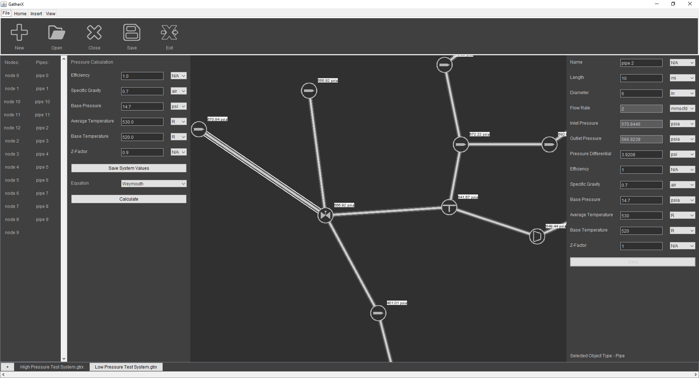

# GatherX Pipeline Simulation Software

## Description

This software was built for the startup GatherX Analytics, which was working to prevent venting and flaring of greenhouse gases.
Oil & Gas companies have their compressor operations shut down by accumulated liquids in networks of wells and pipelines.
It uses computational fluid dynamics to locate, quantify, and visualize the liquids present in pipelines so they can be cleared.
I lost the GitHub account I used to build this with my Rice University student email when I graduated and reuploaded the codebase for my portfolio.

## Table of Contents

- [Usage](#usage)
- [Installation](#installation)
- [Credits](#credits)
- [License](#license)

## Usage

### Creating a Model

To build a model two different types of objects are used: nodes and pipes. Nodes abstractly represent various pieces of midstream equipment, including wells, compressors, control valves, and outlets. Pipes connect nodes and represent physical pipes of various diameter and lengths that connect this equipment. To place objects on the Canvas Panel in the center of the screen go to the Insert Tab on the top menu and select an object to begin placing.
To edit the properties of objects in your system there are two options. The first option is to click on the object and enter the information on the right-hand Data Panel that appears when the object is selected. The second option is to use the left-hand Calculation Panel to quickly set the properties of all pipes in the system. Nodes do not hold gas and ambient data like specific gravity, base pressure, and temperature and must have their parameters set individually.

#### Node Descriptions and Usage:
•	Inlet Node: This node can be used to represent a wellhead or other location at which gas enters the system.
•	Outlet Node: This node can be used to represent a compressor station before sending gas to a long-distance pipeline or other location at which gas exits the system.
•	Tee Node: This node can be used to represent an intersection between pipes or other location with no gas entering or exiting the system.
•	Compressor Node: This node can be used to represent a compressor or other location where a positive pressure differential is a controlled and known quantity.
•	Control Valve Node: This node can be used to represent a control valve or other location where a negative pressure differential is a controlled and known quantity.

#### Pipe Properties and Usage:
To place a pipe, navigate to the Inset Tab and click the Pipe icon. Next, click the first node you want to connect with a pipe, and then click the second node. A pipe will then appear between the two nodes. Pipes may only be placed between two already placed nodes.
*	Pipe Pressures: The pipe inlet and outlet pressure are the pressures at the ends of the pipe and are calculated based on flow through the pipe and environmental properties such as base pressure and temperature.
*	Pipe Diameter: The pipe diameter is an inner diameter and any calculated diameter is drawn from standardized pipe sizes based on a user input pressure differential.
*	Pipe Efficiency: The pipe efficiency is a decimal value that represents the predicted flow based on user input node pressures divided by the flow resulting from the user input values at inlet nodes.

#### Global Properties and Usage:
To set gas and ambient properties for an entire system, navigate to the Calculation Panel and click the Save System Values button. It is recommended to set system wide values before performing a pipe sizing calculation in order to get a consistent pressure differential across the system.

### Analyzing a Model
 
To analyze a model for pressures, pipe sizes, or efficiencies, navigate to the Home Tab and click the New Calculation icon and then select a calculation type. Next, navigate to the Calculation Panel and enter the desired system gas and ambient properties. Please note that running a calculation or saving system values will overwrite previous user specified values. To preserve the results of a previous calculation, see the managing files section on how to save a file. Finally, press the Calculate button in the Calculation Panel.

#### Calculation Descriptions and Usage:
*	Pressures Calculation: This calculation determines pipe and node inlet and outlet pressures and pressure differentials based on flow rates, and gas and ambient properties. It is most commonly used to predict wellhead pressure. This calculation may fail if a control valve or compressor node describes a pressure differential that would result in a vacuum in the system.
*	Pipe Size Calculation: This calculation determines pipe size based on user specified pipe pressure differentials, flow rates, and gas and ambient properties. It is most commonly used to find the most cost-efficient pipe size for a desired pressure differential when designing systems.
*	Efficiency Calculation: This calculation determines pipe flow rate efficiency based on user specified node pressures, flow rates, and gas and ambient properties. It is most commonly used to locate potential issues such as liquid buildup in a system and to then adjust operations accordingly.

## Installation

To run the software out of the box without needing to compile the Java code, follow the following instructions:
1. Install Java on your machine https://www.java.com/en/download/
2. Download the executable Jar file named GatherX 1.1.7.jar
3. Double click to run the file.

Note this version of the software may be ahead or behind the code in the source file on this repository.

## Credits

GatherX Analytics Co-founders: Hugh, Corey, John, and Nick.

Thank you to the creators of DAS Optimization Omer Anil Turkkan and Dr. Haijun Su. You can find their work here https://github.com/aniltrkkn/DasOptimization

## License

MIT License.

## Badges

 

## How to Contribute

The GatherX Analytics team is not supporting, commercializing, or contributing to this software as of August 2021. See [Contributor Covenant](https://www.contributor-covenant.org/) if you would like to make any contributions.

## Tests

Tests are in the test folder and can be executed with JUnit.

